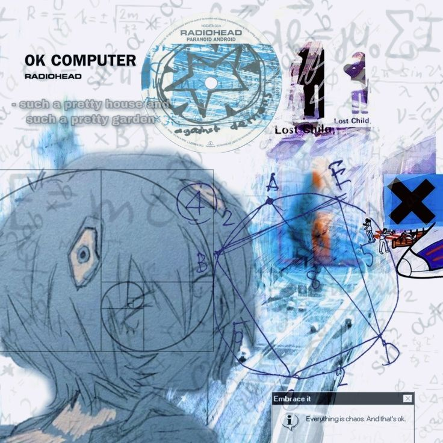
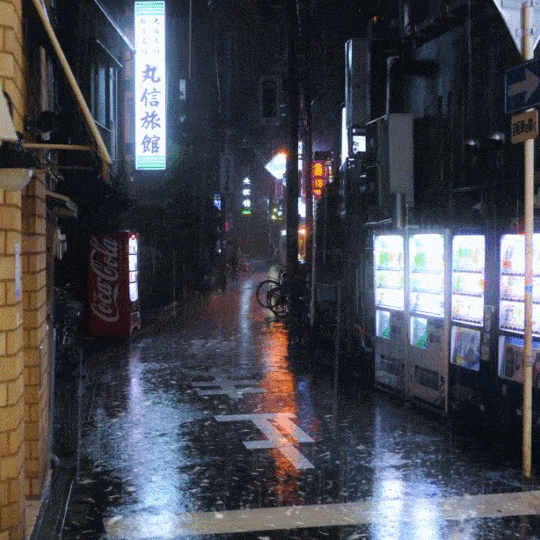

<!-- ───────── BANNER ───────── -->

# alizo's Board ✦

  

<!-- ───────── PROFILE + ABOUT ───────── -->
<table width="100%">
<tr>
<td width="32%" valign="top" align="center">

## Hi, I'm alizo  
Building things in Horsens 🇩🇰

</td>
<td width="68%" valign="top">

<big>

`// ~/about-me.ts`

`const location = "White Space";`

`const roles = ["student engineer", "video editor"];`

`const games = ["TLoU", "Deltarune"];`

`// learn by doing, larp it 'til it's done`

</big>

</td>
</tr>
</table>

<!-- ───────── DIVIDER ───────── -->

<code>◤ ▬▬▬▬▬▬▬ ✦ ▬▬▬▬▬▬▬ ◥</code>

<!-- ───────── BOARD GRID 1 ───────── -->
<table width="100%">
<tr>
<td width="55%" valign="top">

## ⚡ /tech-stack

**also fluent in**

</td>
<td width="45%" valign="top" align="center">

<code>/inspiration</code>

</td>
</tr>
</table>

<!-- ───────── DIVIDER ───────── -->

<code>◤ ▬▬▬▬▬▬▬ ✧ ▬▬▬▬▬▬▬ ◥</code>

<!-- ───────── NOW PLAYING (functional Spotify) ───────── -->
<table width="100%">
<tr>
<td width="45%" valign="top" align="center">

<code>/white-space</code>

</td>
<td width="55%" valign="top" align="center">

## 🎧 now playing

</td>
</tr>
</table>

<!-- ───────── DIVIDER ───────── -->

<code>◤ ▬▬▬▬▬▬▬ ✧ ▬▬▬▬▬▬▬ ◥</code>

<!-- ───────── BOARD GRID 2 ───────── -->
<table width="100%">
<tr>
<td width="40%" valign="top" align="center">

<code>/angel-aura</code>

</td>
<td width="60%" valign="top">

## 🏆 /achievements

<big><big>🏅 &nbsp;**Triple Certiport** — Python, DBs & Device Config </big></big> 
<big><big>🤖 &nbsp;**Robotics Sensei** — 2 yrs teaching IT & robotics </big></big> 
<big><big>🎬 &nbsp;**Timeline Wizard** — freelance edits in After Effects </big></big>

 

## 🗣️ languages

<big>`EN` · `RO` · `RU` · `FR` · `DA`</big>

</td>
</tr>
</table>

<!-- ───────── DIVIDER ───────── -->

<code>◤ ▬▬▬▬▬▬▬ ✦ ▬▬▬▬▬▬▬ ◥</code>

<!-- ───────── STATS ───────── -->

## 📊 /stats

 

  

<!-- ───────── DIVIDER ───────── -->

<code>◤ ▬▬▬▬▬▬▬ ✦ ▬▬▬▬▬▬▬ ◥</code>

<!-- ───────── CONNECT ───────── -->
## ✦ let's connect

<big>Always down to collab or just chat.</big>

